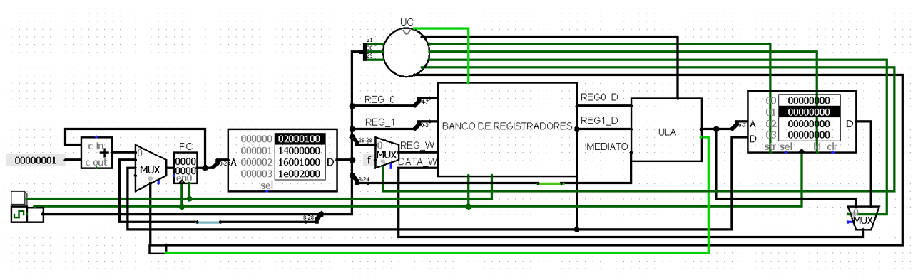

# 🕺 BLDIM*
*Beautiful Loving Dear Impressive Microprocessor*  
**Lê-se "Billie Jean"*

Projeto desenvolvido como parte das atividades da cadeira de Arquitetura e Organização de Computadores da Universidade Federal do Cariri, ministrada pelo professor Ramon Nepomuceno.  
Trata-se de um microprocessador inspirado no MIPS capaz de realizar a multiplicação de duas matrizes 4x4 informadas na memória de dados. Desenvolvi também um projeto de lingugagem assembly e o respectivo código que realiza a função desejada.

## Estrutura do Repositório
- BLDIM.cir: circuito principal, a ser executado no Logisim;
- bldim_assemblyCode.txt: contém o suposto código de multiplicação de matrizes na lingaugem assembly planejada para o bldim;
- bldim_compiler.py: porgrama em python que permite traduzir um código em assembly-mips para o hexadecimal correspondente que será lido pelo processador;
- bldim_hexData: hexadecimal correspondente aos dados a serem gravados na memória de dados do processador, contendo o conteúdo das matrizes a serem multiplicadas;
- bldim_hexInstructions: hexadecimal correspondente ao código que realiza a função de multiplicação de matrizes, após tradução do assembly;
- bldim_report: relatório de projeto enviado ao professor da disciplina, detalhando as etapas de desenvolvimento.

## Tecnologias e Ferramentas

## Créditos
**Contribuidor:**

**Professor Proponente:**

